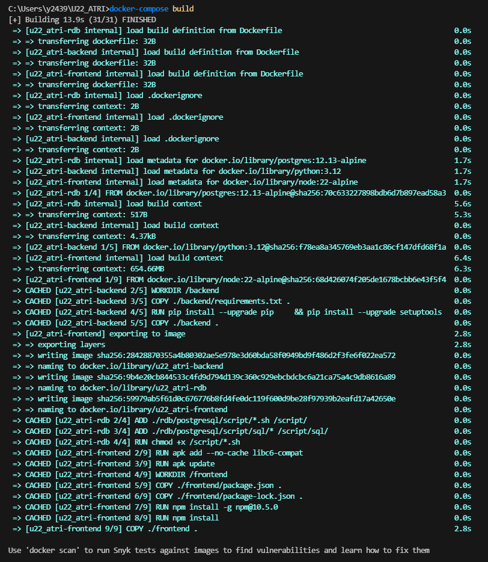
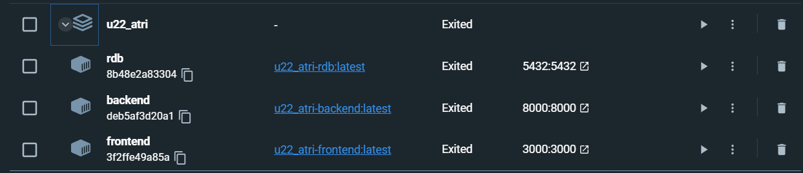
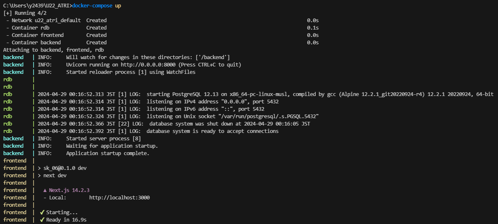
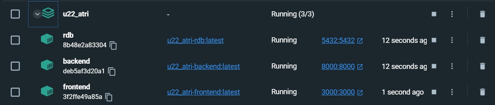
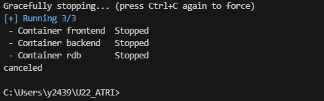
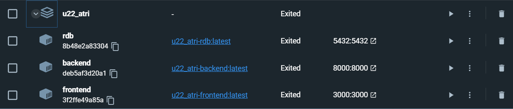

# U22_ATRI
U22プログラミングコンテストに向けて作成したアプリのリポジトリです。

 

# 利用技術
- フロントエンド：Next.js（React, TypeScript）
- サーバーサイド：FastAPI, OpenCV, MediaPipe（Python）
- データベース：PostgreSQL（SQLAlchemy）

 

# Dockerのセットアップ
- Docker Desktopがインストール出来ていない　－＞　1番参照
- それ以外　－＞　2番参照
 

### 1. Docker Desktopのインストール
- dockerを用いたコンテナ開発を行うにあたり、Docker Desktopのインストールが必要です。
- [こちら](https://www.docker.com/ja-jp/products/docker-desktop/)からダウンロードしてください。

 

### 2. コンテナを構築する
- `U22-ATRI`がカレントディレクトリであることを確認してください。
- コマンドプロンプトにて`docker-compose build`を実行してdockerイメージをビルドします。

- 続いて`docker-compose up`を実行してコンテナを作成・実行します。
- ネットワーク通信の許可を要求された場合、**許可**してください。
  許可しなければ正常に動作しません。

- 実行中のコンテナを停止するには、`Ctrl + C`キーで停止してください。

 

### 3. コンテナを削除する
- コマンドプロンプトにて`docker-compose down`を実行してコンテナを削除します。
- `docker-compose build`によって同じものを再度作成できるので消しても特に問題ありません。